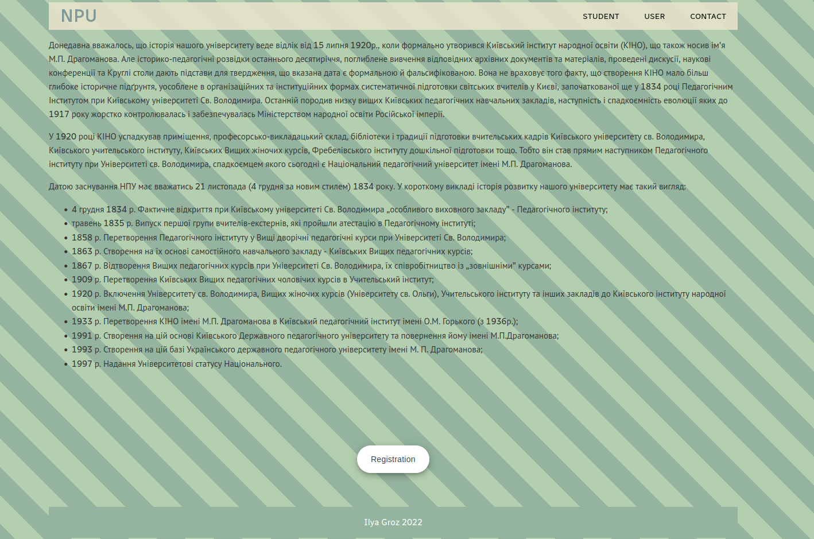
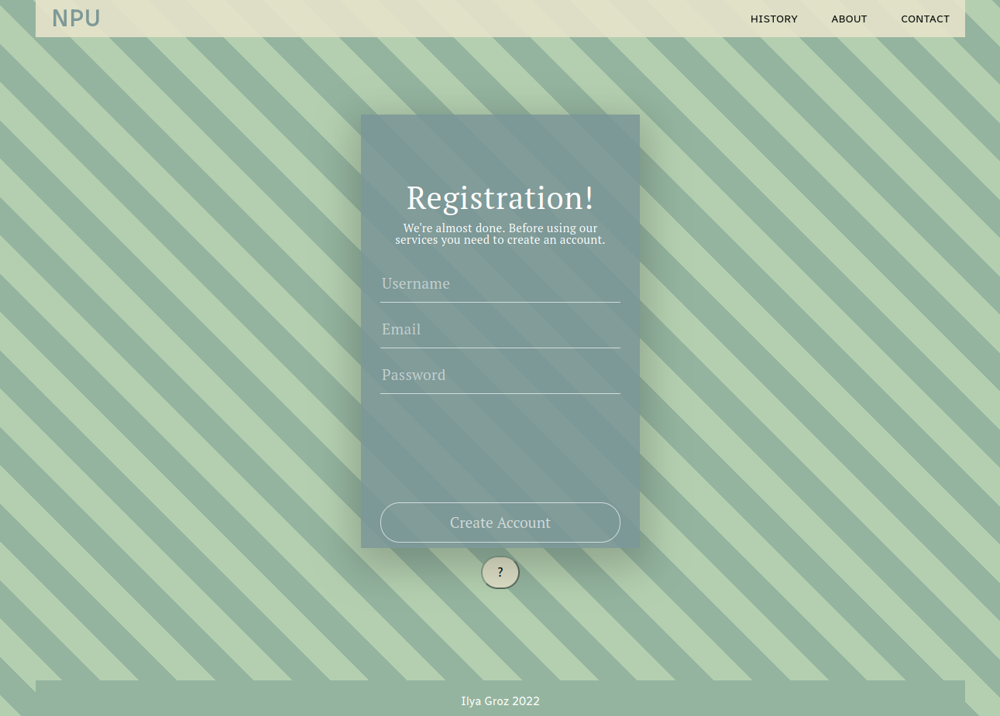
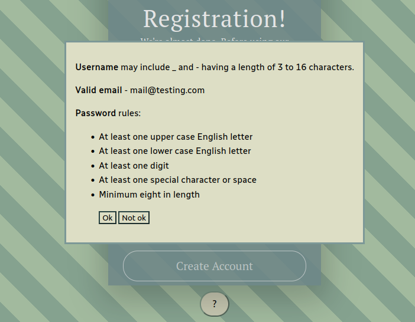
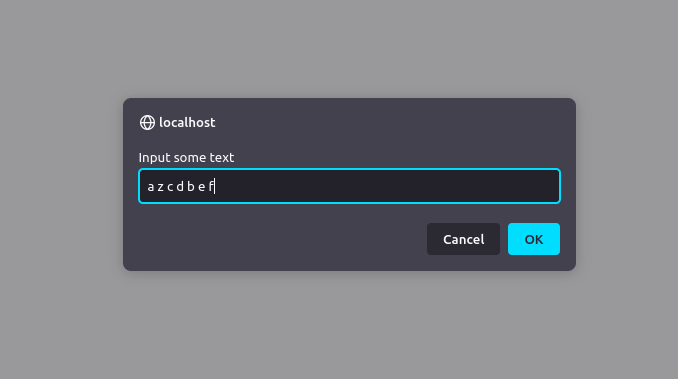
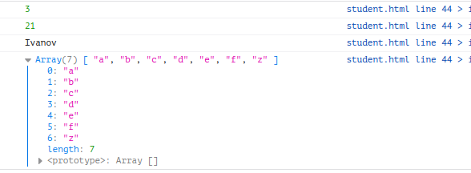
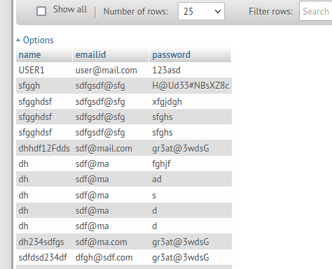
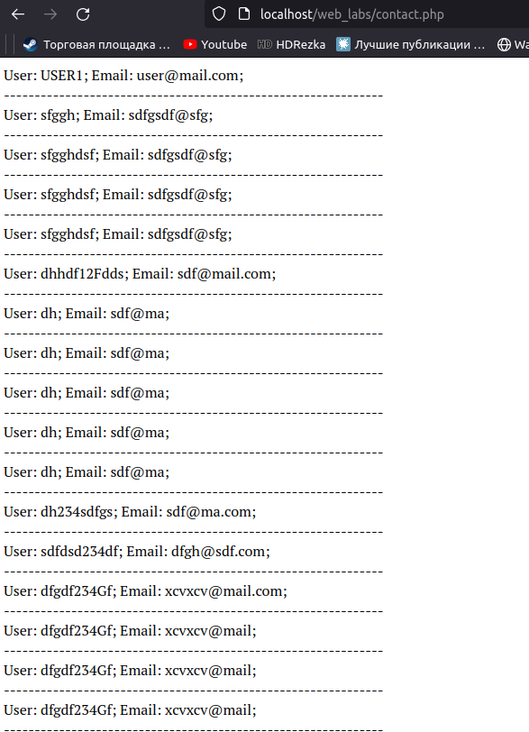
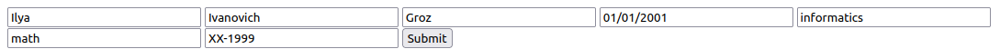
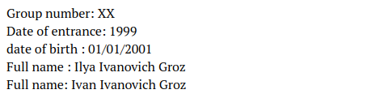

# Лабораторні роботи Грозь - Ілля 41ІПЗ

## Лабораторна робота №1
### Створення веб-сторінки формату HTML 5

1. В лабораторній роботі потрібно створити HTML-сторінку, на якій буде розміщена інформація з історії НПУ та відомості щодо його випускників (джерелом інформації щодо випускників можуть бути соціальні мережі).



- Дана сторінка має обов’язково містити елементи сучасного HTML5 (роботи, виконані ізвикористанням лише HTML4, зараховані не будуть).
 
*code blocks in: index.html, registration.html*

```html 
<meta charset="UTF-8">
```
```html
<div class="container">
        <header class="header">
            <div class="header__inner">
                <div class="header__logo"><a href="index.html">NPU</a></div>
                <nav class="nav">
                    <a href="OOP/student.html">Student</a>
                    <a href="OOP/index.html">User</a>
                    <a href="contact.php">Contact</a>
                </nav>
            </div>
        </header>
```
```html
<form action="backend/getdata.php" method="post" onsubmit="return validate(this);">
    <div class='input-fields'>
        <input type='text' placeholder='Username' name='username_input' class='input-line full-width' id='username_input'></input>
        <input type='email' placeholder='Email' name="email_input" class='input-line full-width' id='email_input'></input>
        <input type='password' placeholder='Password' name="pass_input" class='input-line full-width' id='pass_input'></input>

      </div>
      <div class='spacing'></div>
      <div><button class='ghost-round full-width' value="Submit" name="create_account" >Create Account</button></div>
</form>
```

2. Створити окрему сторінку з HTML-формою для реєстрації
випускників, яка має містити поля різних типів (в тому числі і
такі, які були введені у форматі HTML5).



- Із використанням атрибутів HTML5 забезпечити перевірку коректності даних, що вводяться користувачем у форму.

```html
<input type='text' placeholder='Username' name='username_input' class='input-line full-width' id='username_input'></input>
<input type='email' placeholder='Email' name="email_input" class='input-line full-width' id='email_input'></input>
<input type='password' placeholder='Password' name="pass_input" class='input-line full-width' id='pass_input'></input>
```

## Лабораторна робота №2
### Форматування HTML-сторінки із використанням каскадних таблиць стилів CSS

1. Продемонструвати навички створення селекторів по елементу,
селекторів по класу та групових селекторів при оформленні вмісту
сторінки.

```css
@media (max-width: 500px) {
  .window {
    width: 100%;
    height: 100%;
  }
  .overlay {
    width: 100%;
    height: 100%;
  }
}

#block__help__button {
    justify-content:center;
    display: flex;
    align-items: center;
    margin: 10px 0 0 0;
}
```
2. На сторінці з реєстраційною формою, створеною під час виконання
лабораторної роботи No1, додати діалогове вікно, яке міститиме
додаткову пояснювальну інформацію та буде виконане із
використанням можливостей CSS3 (надалі буде використане у
лабораторній роботі No3 для діалогу з користувачем).



## Лабораторна робота №3
### Мова сценаріїв JavaScript

1. Написати JS-сценарій, який виведе у діалоговому вікні пояснювальну
інформацію щодо введення даних до форми, розробленої при виконанні
лабораторної роботи No1, у випадку коли користувач протягом деякого
інтервалу часу (1 хв, наприклад) не внесе даних до форми – використати
запуск JavaScript за розкладом.


*js/validation_jquery.js*
```javaScript
if(valid){
    f.submit();
}else {
    $("#help__button").click();
}
```
*js/timer.js*
```javaScript
function someFunc (){
    var userName = document.getElementById('username_input').value == "";
    var emailInput = document.getElementById('email_input').value == "";
    var passInput= document.getElementById('pass_input').value == "";

    if(userName && emailInput && passInput ){
        var helpButton = document.getElementById('help__button');
        helpButton.click();

    }
}

setTimeout(someFunc,5*1000);
```
2. Здійснити попередню перевірку коректності даних, які вносяться
користувачем у форму. Перевірку реалізувати у вигляді окремого JS-
сценарію, для перевірки коректності заповнення полів слід застосувати
механіхм регулярних виразів RegExp.

*js/validation_input.js*
```javaScript
function validate(f)
{
var name_validate =  /^[a-z0-9_-]{3,15}$/ ;
var email_validate =  /[^@ \t\r\n]+@[^@ \t\r\n]+\.[^@ \t\r\n]+/ ;
var pass_validate =  /^(?=.*?[A-Z])(?=.*?[a-z])(?=.*?[0-9])(?=.*?[#?!@$ %^&*-]).{8,}$/ ;
var valid = true;
 var name = document.getElementById( "username_input" );
 if( name.value.match(name_validate) == null )
 {
     valid = false;
 }

 var email = document.getElementById( "email_input" );
 if( email.value.match(email_validate) == null  )
 {
     valid = false;
 }

 var password = document.getElementById( "pass_input" );
 if( password.value.match(pass_validate) == null )
 {
     valid = false;
 }
    if(valid){
        f.submit();
    }else {
        var helpButton = document.getElementById('help__button');
        helpButton.click();
    }
    return valid;
}
```
3. Реалізувати аналогічну перевірку із використанням бібліотеки jQuery
validate.

*js/validation_jquery.js*
```javaScript
var name = $("#username_input").val(); 
...
```

4. Продемонструвати можливість створення користувацього об’єкту
засобами JavaScript. Створити об’єкт Student із властивостями name,
surname, age, course та властивостями GetOlder()- зміна віку на
вказану кількість років, ChangeSurname() - зміна прізвища,
MoveToSecondCourse() – переведення на наступний курс.

*OOP/student.html*
```javaScript
class Student{
    constructor(name, surname, age, course){
        this.name = name;
        this.surname = surname;
        this.age = age;
        this.course = course;

    }

    GetOlder(age) {
        this.age = age;
    }

    ChangeSurname(surname) {
        this.surname = surname;
    }

    MoveToSecondCourse () {
        this.course += 1;
    }
}

let S = new Student('Ilya','Groz',12, 2);

S.MoveToSecondCourse();
S.GetOlder(21);
S.ChangeSurname('Ivanov');

console.log(S.course);
console.log(S.age);
console.log(S.surname);


/*Sort text*/

var input = prompt("Input some text");

console.log(sortText(input));

function sortText(text){
    var words = text.split(' ');
    words.sort();
    return words;
}
```

5. Реалізувати користувацьку JS-функцію відповідно до варіанту:
    3. Функція, що виводить слова заданого тексту у алфавітному порядку.




## Лабораторна робота №4
### Використання PHP

1. Створити програму, що обробляє дані від форми реєстрації, що
було створено в межах 1-2 лабораторних робіт. Забезпечити різноманітність
варіантів реагування програми в залежності від даних форми, що
відправляються. Забезпечити реагування на всі можливі помилки заповнення
форми або інші помилки.

*backend/getdata.php*
```php
<?php
ini_set('display_errors', 1);
ini_set('display_startup_errors', 1);
error_reporting(E_ALL);
function validate_data($data)
 {
  $data1 = trim($data);
  $data1 = stripslashes($data1);
  $data1 = strip_tags($data1);
  $data1 = htmlspecialchars($data1);
  return $data1;    
 }

if( isset( $_POST['create_account'] ) )
{


 $name = validate_data( $_POST['username_input'] );
 $emailid = validate_data( $_POST['email_input'] );
 $password = validate_data( $_POST['pass_input'] );

 $host = 'localhost';
 $user = 'root';
 $pass = '';
 $dbname = 'demo';


$conn = new mysqli($host, $user, $pass, $dbname);
// Check connection
if ($conn->connect_error) {
  die("Connection failed: " . $conn->connect_error);
}

$sql = "INSERT INTO user_data (name,emailid , password)
VALUES ('$name', '$emailid', '$password')";

if ($conn->query($sql) === TRUE) {
  echo "New record created successfully";
} else {
  echo "Error: " . $sql . "<br>" . $conn->error;
}

$conn->close();
header("Location: ../index.html");
die();
}
?>
```


*contact.php*
```php
<?php
ini_set('display_errors', 1);
ini_set('display_startup_errors', 1);
error_reporting(E_ALL);

 $host = 'localhost';
 $user = 'root';
 $pass = '';
 $dbname = 'demo';


$connection = new mysqli($host, $user, $pass, $dbname);
$sql = "SELECT * FROM user_data "; 
$result = $connection->query($sql);

/* извлечение ассоциативного массива */
while ($row = $result->fetch_assoc()) {
    echo "User: " . $row["name"]. "; Email: " . $row["emailid"]. ";" ."<br>".
        "--------------------------------------------------------------". "<br>";
}
$connection->close();

?>

```


2. Створити клас User, що міститиме основні властивості: Прізвище,
Ім'я, По-батькові, дату народження; а також основні методи: Отримання
Прізвища І.П., отримання дати народження, отримання віку людини на основі
дати народження, запис Прізвища, Імені, По-батькові (редагування).

```php
class User {
    private $firstName;
    private $middleName;
    private $surname;
    private $birthDate;

    public function __construct($firstName, $middleName, $surname, $birthDate){
        $this->firstName = $firstName;
        $this->middleName = $middleName;
        $this->surname = $surname;
        $this->birthDate = $birthDate;
    }

    public function GetFullName(){
        return "$this->firstName $this->middleName $this->surname";
    }

    public function GetBirthDate(){
        return $this->birthDate;
    }

    public function SetName($input){
        $this->firstName = $input; 
    }

    public function SetMiddleName($input){
        $this->middleName = $input;
    }

    public function SetSurname($input){
        $this->surname = $input;
    }
}
```

3. Створити клас Student, що наслідує клас User та містить такі
основні властивості на доданок до наслідуваних: Факультет, Кафедру та групу
у форматі “ХХ-99”, а також нові методи окрім наслідуваних — отримання ріку
вступу та номеру підгрупи на основі даних про групу в заданому форматі.

```php
class Student extends User{
    private $faculty;
    private $cathedra;
    private $group;

    public function __construct($firstName, $middleName, $surname, 
    $birthDate, $faculty, $cathedra, $group) {
       parent::__construct($firstName, $middleName, $surname, $birthDate);
        $this->faculty = $faculty;
        $this->cathedra = $cathedra;
        $this->group = $group;

   }

    public function GetGroupNumber(){
       $splitedGroup = explode("-", $this->group);
       return $splitedGroup[0];
    }
    public function GetEntrance(){
       $splitedGroup = explode("-", $this->group);
       return $splitedGroup[1];
    }

}

```

4. Виводити дані необхідно на HTML-сторінку в браузері (echo,
printf).

*OOP/index.html*

*OOP/User.php*
```php
echo "Group number: " . $S->GetGroupNumber()  . "<br>" . 
"Date of entrance: " . $S->GetEntrance() . "<br>" . 
"date of birth : " . $S->GetBirthDate() . "<br>" . 
"Full name : " . $S->GetFullName() . "<br>" ; 
$S->SetName("Ivan");
echo "Full name: " . $S->GetFullName() . "<br>"; 
```



